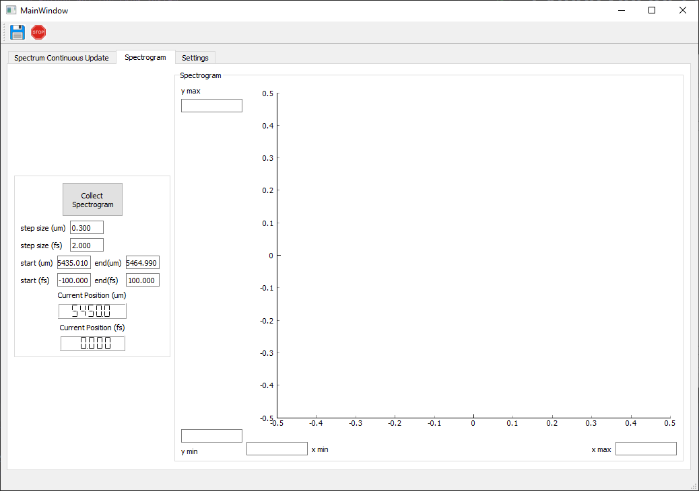

# Python Gui for FROG System

 



## Gui User Instructions

**Spectrum Continuous Update Tab:**
* Use the "Start Continuous Update" button to have the spectrum be updated continuously.
* Use the "Set Ambient" button to set the current spectrum as the ambient background (will be subtracted from future spectra)
* You can reset the ambient background to an arrya of 0's by hitting "Zero Ambient"
* You can step the translation stage towards the origin (step left) and away from the origin (step right) using the "step left" and "step right" button.
  * The step size can be set either in micron or in fs in the line edits.
* Use the home stage button to home the motor.
* You can set the desired position either in micron or fs, and then hit the "move to position button" to move there.
* The current stage position is given on the lcd display in micron and fs (with fs defined by where T0 is)
* Hit the "set T0" button to set the current stage position (read off the lcd display) as T0

**Spectrogram Tab:**

* T0 needs to have been set on the "Spectrum Continuous Update Tab"
* Set the step size, start position, and end position in either fs or micron
* Hit "Collect Spectrogram" to begin the spectrogram collection

**Settings Tab:**
* The only setting I have right now is the integration time for the spectrometer. 

**General Gui User Notes:**
If you hit any button that tells the spectrometer or the motor to do something while the spectrometer or the motor is already in use, the effect will be to stop whatever the spectrometer or motor is currently doing. 

For example, if the motor is currently homing and you hit the "step right" or "move to position" button, the motor will simply stop moving. Only after the program has detected that the motor is no longer in motion, will hitting "move to position" etc. command the motor to move.

I have set a buffer in the program that will not allow the motor to move within 1 micron of its limits. If one attempts to do this, it will pop an error window instead. If you don't want to have this buffer, then change edge_limit_buffer_mm in Gui_Controller.py to 0. 

## Incorporating New Hardware
I wrote the program for a Thorlabs K-cube (KDC101) and Stellarnet's Blue-Wave spectrometer. However, it is possible that one is not using the same translation stage and spectrometer.

**Instructions to Incorporate New Hardware:**

*Spectrometer:* One needs to create a spectrometer class with the following methods and attributes:

*Spectrometer Attributes*:
1. integration_time_micros_limits: [min_int_time_us, max_int_time_us]

*Spectrometer Methods:*
1. spectrum(): returns wavelengths, intensities
2. wavelengths(): returns wavelengths
3. integration_time_micros(integration_time_micros): sets the
        integration time in microseconds

*Translation Stage:* One needs to create a translation stage class with the following methods and attributes:

*Translation Stage Attributes*:
1. position:
   1. note: position needs to be a property, where the getter returns
            the current position, and the setter moves the motor to the new
            position
   2. is_in_motion

*Translation Stage Methods:*
1. get_stage_axis_info: returns min_pos, max_pos, units, pitch
   1. note: the important thing is the min_pos and max_pos, if you like you
        can return None for the other two
2. move_by(value, blocking): moves the motor, blocking doesn't need
        to do anything 
3. move_home(blocking): homes the motor, blocking doesn't need to do
        anything
4. stop_profiled(): stops the motor

Unfortunately, one still needs to figure out how to communicate with the hardware on their own. Most commonly this is done through serial communcation following some protocol, or through a software development kit provided by the vendor. However, the goal is that after one figures out how to do this, the new hardware can be incorporated into the Gui without major revisions to the existing code.

After one writes the translation stage and spectrometer classes, they should be incorporated into the GUI via utilities.py

The Python file Utilities.py defines two classes: a Motor class, and a Spectrometer class. These two classes take as arguments in their init function, the translation stage and spectrometer classes written above. The criteria for what methods and attributes the translation stage and spectrometer classes needs to have are reiterated in the documentation in that file. A good test to see if the new hardware will be incorporated successfully is to run the util file, and verify that the Spectrometer and Motor classes are functional:

```Python
'''one has written Stage and Spectrometer classes'''

stage = Stage()
spectrometer = Spectrometer()

spec = utilities.Spectrometer(spectrometer)
motor = utilities.Motor(stage)

'''Execute the following one line at a time in the console'''
# testing spectrometer:
print(spec.get_spectrum())
print(spec.wavelengths)
print(spec.integration_time_micros)
print(spec.integration_time_micros_limits)
spec.integration_time_micros = 100

# testing motor:
print(motor.max_pos_mm)
print(motor.min_pos_mm)
print(motor.position_mm)
motor.move_by(1.) # move by some value, here by 1mm
print(motor.is_in_motion)
motor.stop_motor()
motor.position_mm = 5. # move to a new position in absolute mode
motor.home_motor()
```

Lastly, if the above tests pass, the new hardware can finally be incorporated into the main GUI by editing the function and variables below in Gui_Controller.py 
```Python
# change emulating_spectrometer and emulating_motor to False
emulating_spectrometer = False
emulating_motor = False

def connect_motor_spectrometer(self):
    if emulating_motor:
        self.motor_interface = MotorInterface(util.Motor(em.Motor()))
    else:
        # here create an instance of the Translation Stage class you wrote (call it stage) 
        # then set self.motor_interface to MotorInterface(utilities.Motor(stage)) 
        
        # in the code, below, I have set it to use a 
        # motor instance written for the KDC101 Thorlabs K-cube 
        motor = apt.KDC101(port)
        self.motor_interface = MotorInterface(util.Motor(motor))

        # here create an instance of the Spectrometer class you wrote (call it spectrometer) 
        # then set self.spectrometer to utilities.Spectrometer(spectrometer) 
        
        # in the code, below, I have set it to use a 
        # spectrometer instance written for the Stellarnet Blue-Wave 
    if emulating_spectrometer:
        self.spectrometer = util.Spectrometer(em.Spectrometer())
    else:
        self.spectrometer = util.Spectrometer(snp.Spectrometer())
```

# Package Requirements
You need to have the following packages installed:
1. numpy
2. scipy
3. matplotlib
4. PyQt5
5. pyqtgraph
6. pandas

Since it was proprietary, I've removed the Stellarnet_Python_Drivers folder that contained the software development kit provided by Stellarnet.
